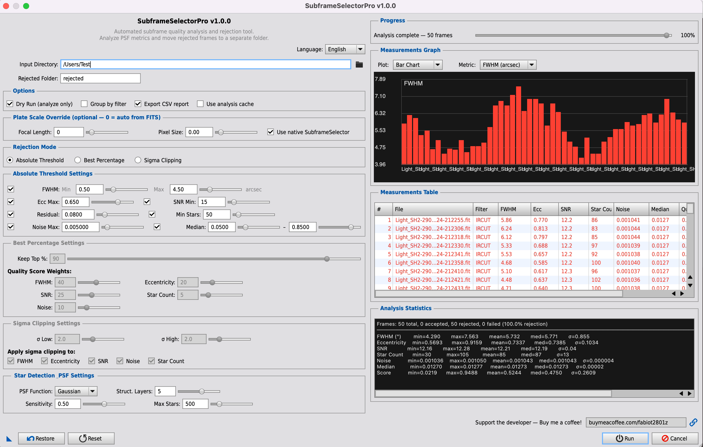

<div align="center">

# SubframeSelectorPro


**Automated Subframe Quality Analysis & Rejection for PixInsight**

<br>

SubframeSelectorPro is a professional-grade PixInsight script that automatically analyzes the quality of astronomical subframes (light frames), scores them using PSF and image statistics metrics, and separates good frames from bad ones by moving rejected files into a dedicated subfolder.

Built to integrate seamlessly with the PixInsight environment, it leverages the native SubframeSelector process as its PSF analysis backend for maximum accuracy, and includes an intelligent caching system that makes iterative threshold tuning instantaneous.

The dual-panel interface provides real-time visual feedback with interactive graphs, a sortable measurements table, and comprehensive statistics — all directly within the dialog.

<br>



</div>

---

## Feature Highlights

### Three Rejection Modes

| Mode | Description |
|------|-------------|
| **Absolute Threshold** | Reject frames exceeding user-defined limits on any metric. Each metric (FWHM, Eccentricity, SNR, Star Residual, Star Count, Noise, Median) can be individually enabled/disabled. |
| **Best Percentage** | Keep only the top N% of frames ranked by a customizable weighted quality score. Weights are adjustable for each metric. |
| **Sigma Clipping** | Self-adapting statistical rejection. Calculates mean and standard deviation for each metric across all frames, then rejects outliers beyond Nσ. No need to know absolute threshold values for your setup. |

### Core Capabilities

- **Dual-Panel Professional UI** — Configuration parameters on the left, real-time results visualization on the right. Interactive graphs, sortable table, and statistics update live during analysis.
- **Native SubframeSelector Backend** — Uses PixInsight's built-in SubframeSelector process for PSF fitting, producing metrics identical to the native tool. Includes batch processing mode for optimized throughput. Automatic fallback to StarDetector if SubframeSelector is unavailable.
- **Interactive Measurements Graph** — Custom-painted chart control with bar chart, scatter plot, and weight map modes. Selectable metrics (FWHM, Eccentricity, SNR, Star Count, Noise, Median, Quality Score, Star Residual). Mouse hover highlights individual frames with tooltip details. Rejection threshold lines overlay automatically.
- **Sortable Results Table** — TreeBox-based measurements table with 11 columns, color-coded rows (green = accepted, red = rejected, grey = failed), and sortable column headers.
- **Statistics Summary Panel** — Per-metric min/max/mean/median/σ statistics with frame counts and rejection rates, displayed in a monospace panel.
- **Progress Bar** — Live progress tracking during analysis with frame counter, percentage, and current file name.
- **Analysis Cache** — Results are cached in a JSON file. Re-running on the same folder with different rejection settings skips the entire analysis phase. Cache is automatically invalidated when files change (size/timestamp) or PSF parameters are modified.
- **Filter-Aware Grouping** — Reads the `FILTER` FITS keyword and applies rejection criteria separately for each filter group. Essential for LRGB and narrowband imaging where different filters have inherently different PSF characteristics.
- **Dry Run Preview Mode** — When Dry Run is enabled, clicking Run keeps the dialog open and populates the graph, table, and statistics panels for interactive review. Adjust thresholds and re-run instantly from cache until satisfied.
- **Undo / Restore** — Every move operation saves a restore log (JSON) in the rejected folder. One-click restore puts all files back in their original location.
- **CSV Export** — Detailed CSV report with 16 columns for every frame, ready for analysis in Excel, LibreOffice, or any data tool.
- **Plate Scale Detection** — Automatically reads `FOCALLEN`, `XPIXSZ`, `CDELT1` from FITS headers to convert FWHM from pixels to arcseconds. Manual override available if keywords are missing.
- **Non-Destructive** — Rejected frames are moved, never deleted. Nothing is overwritten.
- **Persistent Settings** — All parameters are saved between sessions via PixInsight's Settings API.
- **Localized Interface** — Full UI translation in English, Italian, Spanish, German, and French, including all graph controls, table headers, and statistics labels.

---

## Requirements

| Component | Minimum Version |
|-----------|----------------|
| PixInsight | 1.8.9-1 or newer (1.8.9-2+ recommended) |
| OS | Windows 10 or later, macOS 11 or later, Linux 64-bit |
| Calibration | Bias, dark, and flat corrected frames |
| Image Formats | FITS, XISF, TIFF, CR2/CR3, RAW, ARW, ORF, RW2, DNG, PNG |

---

## Installation

### Method 1: Manual Installation

1. **Download** or clone this repository:
   ```bash
   git clone https://github.com/Ft2801/SubframeSelectorPro.git
   ```

2. **Copy** the `src/` folder contents to your PixInsight scripts directory:

   | OS | Path |
   |----|------|
   | Windows | `C:\Program Files\PixInsight\src\scripts\SubframeSelectorPro\` |
   | macOS | `/Applications/PixInsight.app/Contents/Resources/src/scripts/SubframeSelectorPro/` |
   | Linux | `/opt/PixInsight/src/scripts/SubframeSelectorPro/` |

   Or use any custom location.

3. In PixInsight, go to **SCRIPT > Feature Scripts > Add**, navigate to the folder containing `SubframeSelectorPro.js`, and click **OK**.

4. The script appears under **SCRIPT > Utilities > SubframeSelectorPro**.

### Method 2: PixInsight Update Repository

Add this URL to PixInsight's update system:

```
https://raw.githubusercontent.com/Ft2801/SubframeSelectorPro/main/updates.xri
```

Go to **RESOURCES > Updates > Manage Repositories > Add** and paste the URL.

---

## Usage Guide

### Quick Start

1. Launch: **SCRIPT > Utilities > SubframeSelectorPro**
2. Select your **Input Directory** containing calibrated light frames
3. Choose a **Rejection Mode** in the left panel
4. Adjust parameters (hover for tooltips)
5. Enable **Dry Run** to preview results
6. Click **Run** — results appear in the right panel (graph, table, statistics) without closing the dialog
7. Adjust thresholds as needed, click **Run** again (instant from cache)
8. When satisfied, uncheck **Dry Run** and click **Run** to execute

### Recommended Workflow

```
First run:  ☑ Dry Run  +  ☑ Export CSV
            → Click Run — dialog stays open
            → Review the graph, table, and statistics in the right panel
            → Adjust thresholds based on visual feedback

Iterate:    Change rejection parameters in the left panel
            → Click Run again — instant (cached)
            → Graph and table update immediately

Execute:    ☐ Dry Run (uncheck)
            → Click Run — dialog closes, files are moved
            → CSV is saved, console report is printed

If unhappy: Re-open script, click [Restore] to undo everything
```

### Understanding the Right Panel

#### Progress Bar

During analysis, the progress bar shows:
- Current frame number and total (e.g., `[42/120]`)
- Current file name being analyzed
- Percentage complete
- "Analysis complete — 120 frames" when finished

When using cached results, progress updates instantly as cached frames are loaded.

#### Measurements Graph

The graph panel offers three visualization modes:

| Mode | Description |
|------|-------------|
| **Bar Chart** | Vertical bars for each frame, color-coded by acceptance status |
| **Scatter Plot** | Dot plot showing metric distribution across frames |
| **Weight Map** | Same as bar chart but optimized for quality score visualization |

**Color coding:**
- 🟢 Green — Accepted frame
- 🔴 Red — Rejected frame
- 🟡 Yellow — Currently highlighted (mouse hover)

**Interactive features:**
- Hover over any bar/dot to see the frame name, metric value, and status in a tooltip
- An orange threshold line is drawn automatically when the selected metric has an active rejection threshold (e.g., FWHM Max when viewing FWHM)

**Available metrics:** FWHM (arcsec), FWHM (px), Eccentricity, SNR, Star Count, Noise, Median, Quality Score, Star Residual

#### Measurements Table

A sortable TreeBox showing all analyzed frames with columns:

| Column | Description |
|--------|-------------|
| # | Frame index |
| File | Filename |
| Filter | FILTER keyword |
| FWHM | FWHM in arcseconds |
| Ecc | Eccentricity |
| SNR | Signal-to-noise ratio |
| Stars | Detected star count |
| Noise | Noise level |
| Median | Median pixel value |
| Score | Quality score (0–1) |
| Status | OK, REJECTED, or FAILED |

Click any column header to sort by that metric. Rows are color-coded: green for accepted, red for rejected, grey for failed analysis.

#### Statistics Summary

A monospace text panel showing comprehensive statistics:

```
Frames: 120 total, 108 accepted, 12 rejected, 0 failed (10.0% rejection)
──────────────────────────────────────────────────────────────────────────
FWHM (")       min=1.234      max=5.890      mean=2.456     med=2.312     σ=0.654
Eccentricity   min=0.1234     max=0.6789     mean=0.3456    med=0.3210    σ=0.0987
SNR            min=12.30      max=65.40      mean=35.67     med=34.50     σ=8.90
Star Count     min=45         max=512        mean=287       med=278       σ=89
Noise          min=0.000456   max=0.004567   mean=0.001234  med=0.001123  σ=0.000567
Median         min=0.08900    max=0.23400    mean=0.15670   med=0.15230   σ=0.02340
Score          min=0.2345     max=0.9876     mean=0.7234    med=0.7456    σ=0.1234
```

---

### Rejection Modes Explained

#### Absolute Threshold

Each metric has an independent threshold. A frame is rejected if **any** enabled metric fails. Checkboxes allow toggling individual checks on/off.

| Metric | Default | Reject When | Meaning |
|--------|---------|-------------|---------|
| FWHM Max | 4.5" | Above | Poor seeing, defocus |
| FWHM Min | 0.5" | Below | Suspicious data, hot pixels |
| Eccentricity | 0.65 | Above | Trailing, guiding errors |
| SNR | 15.0 | Below | Low signal quality |
| Star Residual | 0.08 | Above | Poor PSF fit, distortion |
| Star Count | 50 | Below | Clouds, fog, dew |
| Noise | 0.005 | Above | Excessive background noise |
| Median Min | 0.05 | Below | Failed exposure, shutter issue |
| Median Max | 0.85 | Above | Saturation, light leak, LP |

**Best for:** Experienced users who know their system's characteristics.

#### Best Percentage

All frames are scored using a weighted composite quality metric, then ranked. Only the top N% are kept.

```
Score = Σ(weight_i × normalized_metric_i) / Σ(weight_i)
```

Normalization maps each metric to [0,1] across the dataset, with appropriate inversion (lower FWHM = higher score, higher SNR = higher score, etc.).

| Weight | Default | Direction |
|--------|---------|-----------|
| FWHM | 40 | Lower is better |
| Eccentricity | 20 | Lower is better |
| SNR | 25 | Higher is better |
| Star Count | 5 | Higher is better |
| Noise | 10 | Lower is better |

**Best for:** Quick sessions where you want to keep a fixed proportion.

#### Sigma Clipping

Calculates mean (μ) and standard deviation (σ) for each enabled metric, then rejects frames outside the range:

- **Higher-is-worse metrics** (FWHM, Eccentricity, Noise): reject if value > μ + σ_high × σ
- **Lower-is-worse metrics** (SNR, Star Count): reject if value < μ - σ_low × σ
- **FWHM additionally**: reject if value < μ - σ_low × σ (suspiciously low)

Default σ values: Low = 2.0, High = 2.0

**Best for:** Unknown systems, first-time analysis, or datasets where you don't know what "good" looks like. The algorithm adapts to your data automatically.

---

## Filter Grouping

When **Group by filter** is enabled, the script:

1. Reads the `FILTER` FITS keyword from each frame's header
2. Groups frames by filter name (e.g., L, R, G, B, Ha, OIII, SII)
3. Applies the selected rejection mode **independently within each group**
4. Reports per-filter statistics

This is critical because:
- Narrowband filters (Ha, OIII) typically have worse FWHM and lower SNR than broadband
- Without grouping, all Ha frames might be rejected simply because L frames have better metrics
- Each filter is evaluated against its own population statistics

Frames without a `FILTER` keyword are placed in a "(no filter)" group.

---

## Analysis Cache

When **Use analysis cache** is enabled:

1. After analysis, results are saved to `SubframeSelectorPro_cache.json` in the input directory
2. On subsequent runs, the cache is loaded and each file's signature (size + modification timestamp) is checked
3. Files with matching signatures skip re-analysis entirely
4. Only new or modified files are analyzed

**Cache invalidation occurs when:**
- A file's size or modification time has changed
- The script version has changed
- PSF parameters (function type, structure layers, sensitivity, max stars) have changed
- The "Use native SubframeSelector" setting has changed

This means you can:
- Run with Dry Run, review results in the graph and table
- Adjust thresholds
- Run again — **instant results**, no re-analysis, graph updates immediately
- Change PSF parameters — cache is invalidated, full re-analysis

---

## PSF Analysis Backend

### Native SubframeSelector (Default)

When **Use native SubframeSelector** is enabled, the script invokes PixInsight's built-in `SubframeSelector` process as a `ProcessInstance`. This guarantees:

- **Identical metrics** to what you'd see in the native SubframeSelector tool
- **Batch processing** — all files are submitted at once, leveraging PI's internal C++ multithreading
- **Accurate PSF fitting** with the selected function (Gaussian, Moffat 4/6/8)

### StarDetector Fallback

If SubframeSelector is not available (older PI versions or configuration issues), the script automatically falls back to:

1. `StarDetector` for star detection and count
2. Bounding-box eccentricity estimation
3. `ImageStatistics` for median and noise
4. `image.noiseMRS()` for robust noise estimation

The fallback is fully functional but may produce slightly different metric values compared to the native tool.

---

## Undo / Restore

Every time files are moved to the rejected folder, the script saves a `SubframeSelectorPro_restore.json` file containing the mapping of every moved file:

```json
{
  "scriptName": "SubframeSelectorPro",
  "scriptVersion": "1.0.0",
  "timestamp": "2026-03-15T22:30:45.123Z",
  "entries": [
    {
      "original": "/data/lights/frame_042.fits",
      "moved": "/data/lights/rejected/frame_042.fits"
    }
  ]
}
```

Clicking **Restore** reads this log and moves every file back to its original path. After a successful restore, the log and (if empty) the rejected directory are removed.

Multiple runs accumulate entries in the same restore log, so you can undo multiple rejection sessions at once.

---

## CSV Export

When enabled, a CSV file (`SubframeSelectorPro_report.csv`) is saved in the input directory with the following columns:

| Column | Description |
|--------|-------------|
| File | Filename |
| Filter | FILTER keyword value |
| DateObs | DATE-OBS keyword value |
| Exposure | Exposure time in seconds |
| FWHM_px | FWHM in pixels |
| FWHM_arcsec | FWHM in arcseconds (if plate scale available) |
| Eccentricity | Star eccentricity (0–1) |
| SNR | Signal-to-noise ratio |
| StarResidual | PSF fitting residual |
| StarCount | Number of detected stars |
| Noise | Normalized noise level |
| Median | Median pixel value (0–1) |
| PlateScale | Plate scale in arcsec/px |
| QualityScore | Composite quality score (0–1) |
| Status | ACCEPTED, REJECTED, or FAILED |
| RejectionReasons | Semicolon-separated list of reasons |

---

## Console Output Example

```
SubframeSelectorPro v1.0.0
Copyright (c) 2026 Fabio Tempera
================================================================

Input directory:  /data/M31_lights/
Rejection mode:   Sigma Clipping (σL=2.0 σH=2.0)
Operation:        DRY RUN
Group by filter:  Yes
PSF backend:      Native SubframeSelector
Analysis cache:   Enabled

Scanning for image files...
Found 120 image files.
Cache loaded from previous run.
Using cached results (120 frames)
Frames to analyze: 0 (cached: 120)
────────────────────────────────────────────────────────────────
Analysis complete.
  Cache saved: /data/M31_lights/SubframeSelectorPro_cache.json

Applying rejection criteria...

  ── Filter: Ha (40 frames) ──
  Sigma Statistics:
    fwhm            mean=3.2145  σ=0.4523
    eccentricity    mean=0.3812  σ=0.0934
    snr             mean=28.4500 σ=5.2310

  ── Filter: L (50 frames) ──
  Sigma Statistics:
    fwhm            mean=2.1234  σ=0.3210
    ...

  ── Filter: OIII (30 frames) ──
  ...

================================================================
                    ANALYSIS REPORT
================================================================

File                                 Filter   FWHM   Ecc     SNR Stars    Noise Median   Score Status
-----------------------------------------------------------------------------------------------------------------------
M31_Ha_001.fits                      Ha       3.21  0.342    32.1   287 0.001234 0.1523  0.7845 OK
M31_Ha_002.fits                      Ha       5.89  0.312    25.3   245 0.001456 0.1456  0.4123 REJECTED
    → fwhm: 5.8900 is 5.9σ above mean 3.2145 (limit: +2.0σ)
M31_L_001.fits                       L        1.98  0.289    52.3   412 0.000987 0.1634  0.9234 OK
...

================================================================
Total:    120
Accepted: 108
Rejected: 12
Rejection rate: 10.0%

  Per-filter summary:
    Ha           total=40  accepted=36  rejected=4
    L            total=50  accepted=47  rejected=3
    OIII         total=30  accepted=25  rejected=5
================================================================
CSV report saved: /data/M31_lights/SubframeSelectorPro_report.csv

DRY RUN: 12 frame(s) would be moved to 'rejected/'.
No files were modified.

Total time: 2.3 seconds.

================================================================
SubframeSelectorPro completed.
```

Note: 2.3 seconds for 120 frames because all results were cached from a previous run. Only the rejection logic was recomputed. The graph, table, and statistics panels in the dialog were populated instantly.

---

## PSF Settings Reference

| Parameter | Default | Range | Description |
|-----------|---------|-------|-------------|
| PSF Function | Gaussian | Gaussian, Moffat 4/6/8 | Model function for PSF fitting |
| Structure Layers | 5 | 1–8 | Wavelet layers for star detection |
| Sensitivity | 0.50 | 0.01–1.0 | Star detection sensitivity |
| Max Stars | 500 | 10–5000 | Maximum stars sampled for PSF fitting |

**Recommendations:**
- **Gaussian** — Best for undersampled images (FWHM < 2 px)
- **Moffat 4** — Best for well-sampled images (FWHM > 3 px), models diffraction wings
- **Moffat 6/8** — For very well-sampled, high-quality optics
- Increase **Structure Layers** if your stars are large (long focal length)
- Increase **Sensitivity** for sparse star fields or narrowband data
- Increase **Max Stars** for more statistical robustness (at the cost of speed)

---

## Localization

The interface is fully translated in five languages: English, Italian, Spanish, German, and French. All UI elements including graph controls, table headers, progress indicators, and statistics labels are fully localized.

Select the language from the dropdown in the top-right corner of the dialog. The preference is saved between sessions.

To add a new language, edit `SubframeSelectorPro-i18n.js` and add a new entry to each string array. See [CONTRIBUTING.md](CONTRIBUTING.md) for development guidelines.

---

## Technical Implementation Notes

### Graph Rendering

The measurements graph uses PJSR's `Control` class with a custom `onPaint` handler. All rendering is done via the standard `Graphics` object with `Pen`, `Brush`, and `Font` primitives. No external libraries or image files are required. The graph supports dynamic resizing, automatic Y-axis scaling with padding, grid lines with formatted axis labels, rejection threshold overlay, and mouse tracking with per-frame highlight and tooltip.

### Progress System

The analysis engine exposes a `progressCallback` property that accepts a function with signature `function(currentFrame, totalFrames, fileName)`. The GUI hooks into this to update the Slider widget, percentage label, and status text in real time. The callback fires for cached result restoration, batch result extraction, sequential frame analysis, and fallback individual analysis. All callbacks include `processEvents()` to keep the UI responsive.

### Dual-Panel Layout

The dialog uses a top-level `HorizontalSizer` containing two `VerticalSizer` panels. The left panel contains all configuration controls, the right panel contains progress, graph, table, and statistics. The minimum dialog width is 1400px to accommodate both panels. The layout scales with DPI-aware sizing.

---

## Project Structure

```
SubframeSelectorPro/
├── src/
│   ├── SubframeSelectorPro.js          # Main entry point & feature registration
│   ├── SubframeSelectorPro-i18n.js     # Internationalization (5 languages)
│   ├── SubframeSelectorPro-params.js   # Parameters, defaults, persistence
│   ├── SubframeSelectorPro-engine.js   # Analysis engine, cache, batch, CSV, restore
│   ├── SubframeSelectorPro-gui.js      # Dual-panel UI: config + results visualization
│   └── SubframeSelectorPro.svg         # Toolbar icon (128x128)
├── .github/
│   └── ISSUE_TEMPLATE/
│       ├── bug_report.md
│       └── feature_request.md
├── .gitignore                          # Git exclusions
├── build.ps1                           # PowerShell build automation
├── LICENSE                             # MIT License
├── README.md                           # This file
├── INSTALL.md                          # Installation guide
├── CONTRIBUTING.md                     # Contribution guidelines
├── CHANGELOG.md                        # Version history
└── updates.xri                         # PixInsight update repository descriptor
```

### Generated at Runtime (in your data directory)

| File | Purpose |
|------|---------|
| SubframeSelectorPro_cache.json | Analysis cache |
| SubframeSelectorPro_report.csv | CSV report with metrics |
| rejected/ | Subfolder for rejected frames |
| rejected/SubframeSelectorPro_restore.json | Undo/restore log |

---

## Contributing

Contributions are welcome! For detailed guidelines on how to contribute, report bugs, request features, and set up your development environment, see [CONTRIBUTING.md](CONTRIBUTING.md).

---

## Roadmap

Future improvements under consideration:

- **WBPP integration** — Export accepted file list for WeightedBatchPreprocessing
- **Saveable profiles** — Named presets (e.g., "Refractor Ha", "Newton Broadband")
- **Session comparison** — Compare aggregate metrics across multiple nights
- **Satellite/trailing detection** — Advanced anomaly detection beyond PSF metrics
- **Batch multi-folder** — Process multiple directories in sequence
- **XISF properties** — Write metrics as XISF image properties
- **Dual-axis graphs** — Plot two metrics simultaneously for correlation analysis
- **Per-filter graph coloring** — Different colors per filter in the graph
- **Manual frame override** — Click to toggle individual frame acceptance in the table

---

## Support This Project

If you find SubframeSelectorPro useful, consider supporting the developer:

**[Buy me a coffee](https://buymeacoffee.com/fabiot2801z)** — Your contribution helps fund development, maintenance, and new features.

Every bit helps!

---

## License

This project is licensed under the **MIT License** — see the [LICENSE](LICENSE) file for details.

---

## Author

**Fabio Tempera**

- GitHub: [@Ft2801](https://github.com/Ft2801)
